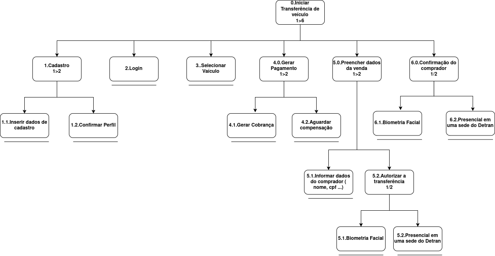

# __Análise Hierarquica de Tarefas__

## __Introdução__

Uma **análise de tarefas** é utilizada para se ter um entendimento sobre qual é o tra-
balho dos usuários, como eles o realizam e por quê.
Em IHC, a análise de tarefas pode ser utilizada nas três atividades habituais: para
análise da situação atual (apoiada ou não por um sistema computacional), para o
(re)design de um sistema computacional ou para a avaliação do resultado de uma
intervenção que inclua a introdução de um (novo) sistema computacional. [Barbosa e Silva (2011, p.191)](../referencias/analise_tarefas.png)

## __HTA – Hierarchical Task AnalysisHTA__

Portando devido as complexidades de certas tarefas e não repetitivas, é utilizado uma abstração do conceito de análise de tarefas.
Chamado de A Análise Hierárquica de Tarefas (HTA – Hierarchical Task Analysis), Ela ajuda a relacionar o que
as pessoas fazem (ou se recomenda que façam), por que o fazem, e quais as consequências caso não o façam corretamente. Ela pode ser representada por uma tabela, ou por um diagrama, com a notação conforme a figura 1.

**Figura 1**

_Fonte: BARBOSA e SILVA, 2011._

## __Análise de tarefas__

Dentro das tarefas com método HTA,  foram escolhidos o acesso ao CNH do usuário, Agendar um serviço e transfência veícular.

### __Acesso ao CNH do usuário__

Nessa tarefa, o usuário possui o objetivo de acessar os dados de sua CNH . A figura 2 apresenta o diagrama HTA relativa a tarefa, já a tabela 1 representa o mesmo HTA em tabela.

<b>Figura 2</b> - Diagrama HTA de consulta CNH.

Autor: [Kaio Enzo](https://github.com/kaioenzo).

<b>Tabela 1</b> - HTA de visualização de pedidos.

|     Objetivos/Operações      | Problemas e recomendações                                                                                                                                                                               |
| :--------------------------: | ------------------------------------------------------------------------------------------------------------------------------------------------------------------------------------------------------- |
|  0.Visualizar CNH   |                                                                                                                                                                                                         |
|      1.Cadastro      | **input**: dados de cadastro. **feedback**: usuário redirecionado para a página de confirmação de email.  **plano**: confirmar conta e depois fazer login.                                        |
|     1.1.Confirmar perfil     | **feedback**: após confirmar o email o usuário é liberado para fazer login.                                                                                                                             |
|       1.2.login        | **input**: dados de login. **feedback**: usuário redirecionado para a página dos serviços mais acessados.  **plano**: abrir área de CNH.  |
| 2.Acesso a CNH | **input**: apertar na opção de consulta CNH. **feedback**: usuário redirecionado para a página listando a pontuação da carteira                                                                                    |

Autor: [Kaio Enzo](https://github.com/kaioenzo).

### __Agendamento de serviço__

Nessa tarefa, o usuário possui o objetivo de solicitar um agendamento dos serviços prestados pelo Detran . A figura 3 apresenta o diagrama HTA relativa a tarefa, já a tabela 2 representa o mesmo HTA em tabela.

<b>Figura 3</b> - Diagrama HTA de agendamento de serviço.

Autor: [Luiza Maluf](https://github.com/LuizaMaluf).

<b>Tabela 2</b> - HTA de visualização de pedidos.

|     Objetivos/Operações      | Problemas e recomendações                                                                                                                                                                               |
| :--------------------------: | ------------------------------ |
|  0. Realizar o agendamento  |                                                   |
|  1. Acessar o site do Detran  | **input**: Abrir o navegador e digitar a URL do portal **feedback**: Página inicail do DETRAN-DF  **plano**: Continuar para a navegação do agendamento. |
|  2. Navegar para área de agendamento | **input**: Identificar o menu ou ícone de "Serviços" e selecionar "Agendamento". **feedback**: Página de agendamento é exibida com opções de serviços. **Plano**: Selecionar o serviço desejado. |
|  3. Escolher o serviço desejado | **input**: Clicar no serviço relevante na lista apresentada. **feedback**: Detalhes do serviço e botão para continuar são exibidos. **Plano**: Avançar para o preenchimento dos dados.|
|  4. Preencher os dados solicitados | **input**: Inserir nome, CPF, e-mail, telefone e outros dados exigidos. **feedback**: Campos preenchidos são validados em tempo real. **Plano**: Concluir o preenchimento e continuar para a escolha da data.|
|  5. Selecionar a data e horário disponíveis | **input**: Escolher uma data no calendário e selecionar o horário disponível.**feedback**: Indicação de horário reservado para o usuário. **Plano**: Prosseguir para a confirmação.|
|  6. Confirmar o agendamento | **input**: Revisar os dados, clicar em "Agendar". **feedback**: Mensagem de sucesso com número de protocolo e instruções adicionais. **Plano**: Finalizar o processo e, se necessário, armazenar o comprovante.|

Autor: [Luiza Maluf](https://github.com/LuizaMaluf).

### __Transferência de veículo__

Nessa tarefa, o usuário possui o objetivo de transferir veículo  . A figura 5 apresenta o diagrama HTA relativa a tarefa, já a tabela 4 representa o mesmo HTA em tabela.

<b>Figura 5</b> - Diagrama HTA de tranferencia veicular.

Autor: [Márcio Henrique](https://github.com/DeM4rcio).

<b>Tabela 3</b> - HTA de visualização de pedidos.

|     Objetivos/Operações      | Problemas e recomendações                                                                                                                                                                               |
| :--------------------------: | ------------------------------------------------------------------------------------------------------------------------------------------------------------------------------------------------------- |
| 0. Iniciar transferência de veículo | **input**: Início do processo. **feedback**: Usuário deve seguir os passos subsequentes. **recomendação**: Informar ao usuário sobre os requisitos prévios, como documentos necessários.                                          |
|      1. Cadastro      | **input**: Dados de cadastro. **feedback**: Redirecionar para a página de confirmação de perfil.  **recomendação**: Garantir validação dos dados antes do envio.                                        |
|     1.1. Inserir dados de cadastro     | **feedback**: Sistema valida os dados inseridos. **recomendação**: Implementar mensagens de erro claras para dados inválidos.                                                                                                                             |
|       1.2. Confirmar perfil        | **input**: Código de verificação ou link enviado por email. **feedback**: Usuário é liberado para fazer login após confirmação.  **recomendação**: Garantir tempo de expiração para links ou códigos. |
| 2. Login | **input**: Dados de login. **feedback**: Usuário redirecionado para o painel principal. **recomendação**: Oferecer opção de recuperação de senha e login por redes sociais.                                                                         |
| 3. Selecionar veículo | **input**: Dados como placa e RENAVAM. **feedback**: Usuário é redirecionado para a página do veículo escolhido.  **recomendação**: Adicionar filtros para facilitar a busca em casos de múltiplos veículos. |
| 4.0. Gerar pagamento | **input**: Informações sobre o valor a ser pago. **feedback**: Geração de cobrança e aguardar compensação.  **recomendação**: Oferecer diferentes métodos de pagamento (PIX, cartão, boleto). |
| 4.1. Gerar cobrança | **feedback**: Cobrança gerada com sucesso. **recomendação**: Garantir que o usuário receba uma confirmação da transação por email ou SMS. |
| 4.2. Aguardar compensação | **feedback**: Informar status do pagamento em tempo real. **recomendação**: Implementar notificações sobre a compensação. |
| 5.0. Preencher dados da venda | **input**: Informações sobre o comprador, como nome e CPF. **feedback**: Usuário direcionado para autorização da transferência. **recomendação**: Validar CPF e outros dados em tempo real. |
| 5.1. Informar dados do comprador | **feedback**: Dados registrados no sistema. **recomendação**: Verificar inconsistências nos dados automaticamente. |
| 5.2. Autorizar transferência | **feedback**: Sistema solicita confirmação biométrica ou presencial. **recomendação**: Incluir outras formas de autenticação, como assinatura digital. |
| 6.0. Confirmação do comprador | **input**: Biometria facial ou presença física. **feedback**: Transferência concluída. **recomendação**: Melhorar o processo de agendamento presencial para minimizar filas. |
| 6.1. Biometria facial | **feedback**: Autenticação por reconhecimento facial bem-sucedida. **recomendação**: Garantir alta precisão no sistema de biometria. |
| 6.2. Presencial em uma sede do Detran | **feedback**: Confirmação realizada presencialmente. **recomendação**: Simplificar processos burocráticos e oferecer suporte ao usuário no local. |

Autor: [Márcio Henrique](https://github.com/DeM4rcio).

## __Bibliografia__

> RIBEIRO, Bruno; GOBBI, Lucas. Aspectos éticos. Repositório do Grupo Branco Central do Brasil da disciplina Interação Humano-Computador da Universidade de Brasília, 2023. _Disponível em: <https://interacao-humano-computador.github.io/2023.1-BancoCentral/#/analise_requisitos/analise_tarefas?id=an%c3%a1lise-hier%c3%a1rquica-de-tarefas>. Acesso em: 28/11/2024_

## __Referências Bibliográficas__

> _BARBOSA, S. D. J.; SILVA, B. S. Interação Humano-Computador. Rio de Janeiro: Elsevier, 2011._

---
## __Histórico de versão__

| Versão |    Data    |      Descrição      |             Autor(es)                        |Revisor(es)|
|--------|------------|---------------------|----------------------------------------------|---------|
| `1.0`  | 30/11/2024 | Adição de informações da analise de tarefas. | [Márcio Henrique](https://github.com/DeM4rcio)|[Luiza Maluf](https://github.com/LuizaMaluf)| 
| '2.0'  | 20/11/2024 | Correção do HTA do agendamento de serviço | [Luiza Maluf](https://github.com/LuizaMaluf)|[Márcio Henrique](https://github.com/DeM4rcio)|
| ´2.1'  | [Márcio Henrique](https://github.com/DeM4rcio)| [Luiza Maluf](https://github.com/LuizaMaluf)|
