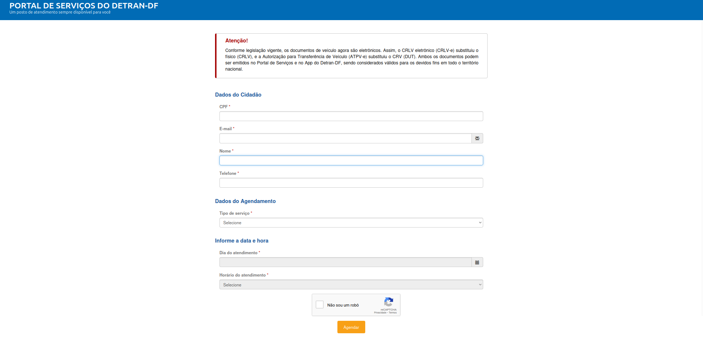
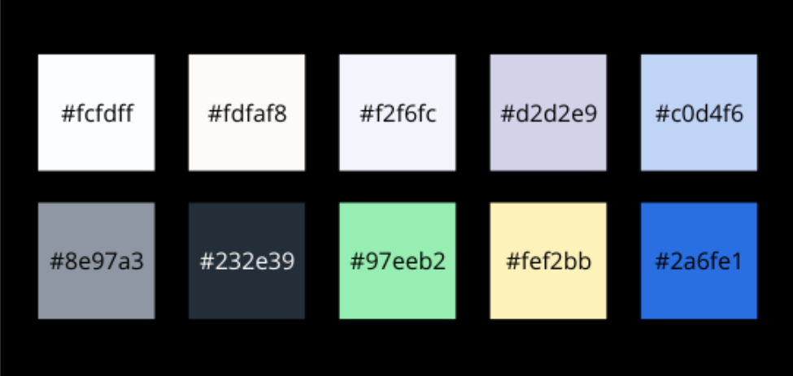

# __Guia de Estilos__

## __Introdução__

### __Objetivo do Guia de Estilo__

O objetivo deste guia de estilo é fornecer diretrizes claras para a criação e manutenção de uma interface de usuário consistente, eficiente e acessível para o Portal DETRAN-DF. Ele abrange aspectos visuais, de interação e de ação que devem ser seguidos por todas as equipes envolvidas no desenvolvimento e manutenção do sistema. A implementação dessas diretrizes visa aprimorar a experiência do usuário e garantir que o portal seja fácil de usar, compreensível e funcional para diferentes perfis de usuários ([Barbosa e Silva, 2011, p.282-283](referencias/guiaEstilo/guiaEstilo.png)).

### __Organização e Conteúdo do Guia de Estilo__

O guia está organizado em várias seções, cobrindo aspectos como os elementos de interface, elementos de interação, ação, vocabulário e padrões. Cada seção detalha diretrizes específicas para garantir a consistência na interface do usuário e facilitar a navegação.

### __Público-Alvo do Guia de Estilo__

O guia de estilo foi projetado para ser utilizado por:

- Programadores: Para garantir que as implementações sejam consistentes com o design e as diretrizes de usabilidade.

- Gerentes de Projeto: Para garantir que a visão do design seja mantida durante o desenvolvimento e em futuras iterações.
    
- Equipe de Suporte: Para que os atendentes saibam como solucionar problemas relacionados à interface do portal com base nos padrões estabelecidos.

### __Como Utilizar o Guia__

O guia de estilo deve ser utilizado sempre que uma atualização for realizada na interface ou quando novas funcionalidades forem introduzidas. Ele serve como uma referência para garantir que o portal continue com uma interface coesa.

### __Como Manter o Guia__

O guia de estilo deve ser atualizado regularmente para refletir mudanças nas necessidades dos usuários, no design e nas tecnologias utilizadas. A manutenção deve ser feita por uma equipe responsável que acompanhará as mudanças no projeto, implementando novos elementos e padrões conforme necessário.

## __Resultados de Análise__

### __Descrição do ambiente de  Trabalho do Usuário__

O ambiente de trabalho do usuário do [Portal DETRAN-DF](https://portal.detran.df.gov.br/#/home) é digital e acessado por meio de navegadores de internet em dispositivos como computadores, tablets e smartphones. O sistema oferece diversas funcionalidades, como consultas de veículos, CNH, multas, e serviços como agendamento e pagamento. O objetivo é garantir que os usuários consigam realizar suas tarefas com facilidade, sem sobrecarregar a interface com informações excessivas ou complexidade desnecessária.

## __Elementos de Interface__

### __Logotipo__

__Figura 1__ - Logo Portal DETRAN-DF

_Fonte: [Portal DETRAN-DF](https://portal.detran.df.gov.br/#/home)_

### __Disposição Espacial e Grid__

__Figura 2__ - Disposição espacial e GRID

_Autor: [Luiza Maluf](https://github.com/LuizaMaluf)_

### __Janelas e Containers__

---

__Figura 3__ - Página de início

_Fonte: [Portal DETRAN-DF](https://portal.detran.df.gov.br/#/home)_

---
__Figura 4__ - Seção "Veículos"

_Fonte: [Portal DETRAN-DF](https://portal.detran.df.gov.br/#/home)_

---

__Figura 5__ - Login

_Fonte: [Portal DETRAN-DF](https://portal.detran.df.gov.br/#/home)_

---

__Figura 6__: Preenchimento do Formulário de Inclusão de gravame

Fonte: [Portal DETRAN-DF](https://portal.detran.df.gov.br/#/home)

---

__Figura 7__: Consulta das restrições de um veículo

Fonte: [Portal DETRAN-DF](https://portal.detran.df.gov.br/#/home)

---

__Figura 8__: Página de agendamento de serviços

_Fonte: [Portal de Serviços do Detran](https://portal.maestro.detran.df.gov.br/agendamento/#/index)_

### __Tipografia__

__Figura 9__: Tipografia

_Autor: [Luiza Maluf](https://github.com/LuizaMaluf)_

### __Cores__

__Figura 10__: Cores

_Autor: [Luiza Maluf](https://github.com/LuizaMaluf)_

## __Elementos de Interação__

### __Estilos de Interação__

- Clique: As interações são ser claras. Elementos clicáveis, como botões e links, são destacados com cores contrastantes (mudança de cor ou sublinhado).
    
- Arraste e Solte: Para funcionalidades de upload de documentos, permitir que o usuário arraste e solte com feedback visual (e.g., sombra ao arrastar um item).

### __Seleção de um Estilo__

- Cada interação é consistente com a função que ela executa. Por exemplo, todos as subseções relacionadas a "Consultas" dentro do Portal possui coloração verde, assim como as "Credenciais"são roxas e os aspectos relacionado aos "Veículos" estão em roxo.

### __Aceleradores (Teclas de Atalho)__

O portal não possui teclas de atalho

## __Elementos de Ação__

### __Preenchimento de Campos__

- Os campos de formulário são bem definidos e com rótulos claros. Cada campo tem um texto de exemplo ou placeholder que oriente o usuário sobre o que inserir.
    
- Campos obrigatórios: são indicados com um asterisco (*) e as mensagens de erro são exibidas de forma clara, destacando os campos que precisam ser corrigidos.

### __Seleção__

- Para campos de seleção, como listas suspensas ou caixas de seleção, há uma descrição clara do que está sendo selecionado.

    - Exemplo: "Consultar" na figura 7 em que seleciona a consulta do veículo.

### __Ativação__

- A ativação de botões e links deve é com a cor de fundo e do texto diferenciadas, além de utilizar efeitos de hover ou foco que indiquem ao usuário que a ação pode ser realizada.

## __Vocabulário e Padrões__

### __Terminologia__

- A terminologia é clara e consistente ao longo do portal. Termos como "agendar", "consultar", "editar" e "cancelar" são utilizados de forma consistente, com a mesma grafia e significado em todas as páginas e interações.

### __Tipos de Tela (Para Tarefas Comuns)__

- Tela Inicial: Exibe links rápidos para as principais funções do portal, como "Consultar Multas", "Agendar Atendimento", "Verificar CNH".

- Tela de Consulta: Apresenta tipos de consultas que o usuário pode realizar dentro das subseções.
    
- Tela de Emissão: Exibe os documentos que o usuário tanto pessoais quanto de seu veículo que podem ser emitidos.

### __Sequências de Diálogos__

Para Feedback ou Confirmação de uma Operação:

- Exemplo: Após o usuário agendar um serviço, uma janela de confirmação aparece com a mensagem "Seu agendamento foi realizado com sucesso".

## __Bibliografia__

> [Plano de Ensino da Disciplina - 2024](../assets/documentos/Plano_de_Ensino.pdf)

## __Referências Bibliográficas__

> _BARBOSA, S. D. J.; SILVA, B. S. Interação Humano-Computador. Rio de Janeiro: Elsevier, 2011._

---

## _Histórico de versão_

| Versão |    Data    |      Descrição      |             Autor(es)                        | Revisores |
|--------|------------|---------------------|----------------------------------------------|-----------|
| 1.0  | 02/12/2024 | Construção do Guia de Estilo. | [Luiza Maluf](https://github.com/LuizaMaluf) | [Márcio Henrique](https://github.com/DeM4rcio) |