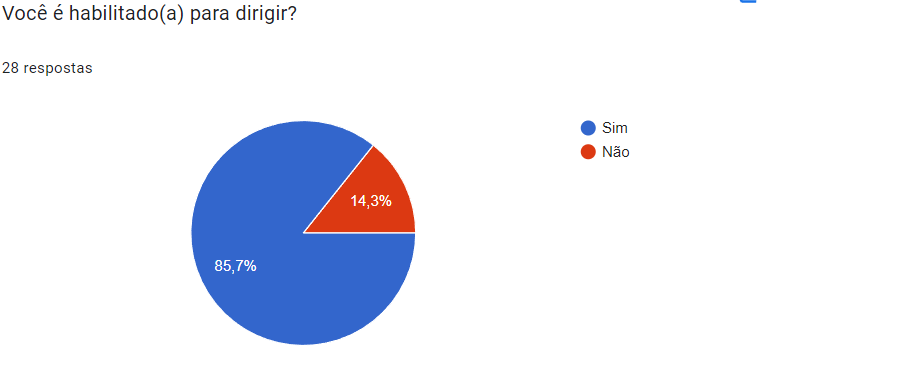
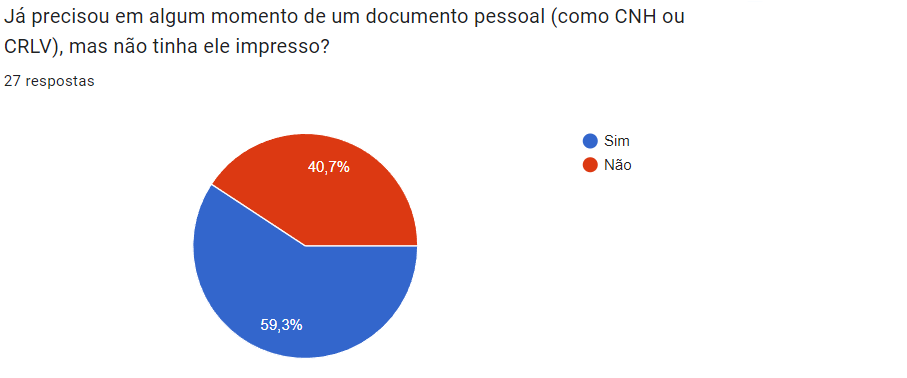
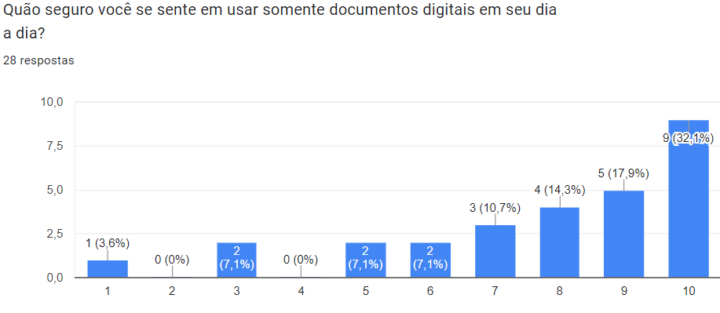
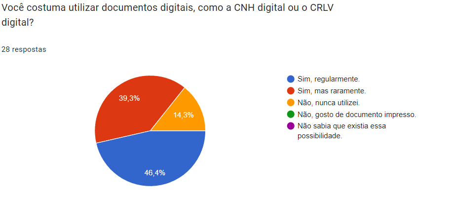

# __Perfil do Usuário__

## __Introdução__

O __Perfil de Usuário__, segundo [Barbosa e Silva (2011, p.174 e p.175)](referencias/perfilUsuario01.png) é uma etapa essencial no desenvolvimento de sistemas e produtos, pois permite compreender quem são os usuários e quais objetivos eles desejam alcançar. Esse processo vai além de uma simples identificação; ele oferece insights fundamentais para direcionar o design e priorizar características que atendam às necessidades reais dos usuários. Além disso, a definição de perfis auxilia no recrutamento de participantes para futuras atividades, como análises e avaliações, garantindo um desenvolvimento iterativo e centrado no usuário.

Segundo [Barbosa e Silva (2011, p.140)](referencias/perfilUsuario02.png), a ativide essencial no desenvolvimento de um produto de qualidade é entender quem são seus usuários. Por meio da coleta de dados específicos — como experiência, nível de instrução e tarefas desempenhadas —, é possível agrupar os usuários em categorias relevantes. Essas informações, devidamente organizadas e priorizadas, ajudam a garantir que o produto final seja efetivo, acessível e alinhado às expectativas de quem irá utilizá-lo, promovendo uma experiência significativa e satisfatória.

## __Metodologia__

Para a definição do Perfil do Usuário do projeto foi definido a realização de um questionário à grupos com potenciais usuários.

### __Vantagens__

- Técnica prática e simplificada para ser aplicada;
- Facilidade em armazenar informações em massa;
- Mais confortável para os entrevistados em termos de demanda de tempo e disponibilidade para se fazer a entevista;
- Possibilidade de entrevistar pessoas de regiões diferentes.
- Disponibilidade de dados tanto quantitativos quanto qualitativos para análise.

### __Desvantagens__

- Caso não se tenha muitas respostas, os dados podem não ser suficientes para a definição do perfil de usuário;
- Um questionário mal elaborado pode trazer dados que não agregam ao projeto;
- Questões que trazem dados qualitativos podem demandar mais esforços paraserem analisados.

## Resultados Coletados
Abaixo estão os resultados coletados do questionário aplicado aos usuários. Tivemos 27 respostas, antes da coleta os usuários foram informados dos [termos de consentimento](./aspEticos/#termo-de-consentimento-livre-e-esclarecido-tcle). Dos 27 usuários que participaram da pesquisa

### Questão 1: Qual a sua faixa etária?

Figura 1: Gráfico da resposta da questão 1

Autor: Kaio Enzo

### Questão 2: Qual sua ocupação principal?

Figura 2: Gráfico da resposta da questão 2

Autor: Kaio Enzo

### Questão 3: Você é habilitado(a) para dirigir?

Figura 3: Gráfico da resposta da questão 3

Autor: Kaio Enzo

### Questão 4: Você tem um veículo próprio?

Figura 4: Gráfico da resposta da questão 4

Autor: Kaio Enzo

### Questão 5: Caso tenha veículo próprio, você utiliza seu veículo como fonte de renda, trabalhando como motorista de aplicativo?

Figura 5: Gráfico da resposta da questão 5

Autor: Kaio Enzo

### Questão 6: Já precisou em algum momento de um documento pessoal (como CNH ou CRLV), mas não tinha ele impresso?

Figura 6: Gráfico da resposta da questão 6

Autor: Kaio Enzo

### Questão 7: Quão seguro você se sente em usar somente documentos digitais em seu dia a dia?

Figura 7: Gráfico da resposta da questão 7

Autor: Kaio Enzo

### Questão 8: Você costuma utilizar documentos digitais, como a CNH digital ou o CRLV digital?

Figura 8: Gráfico da resposta da questão 8

Autor: Kaio Enzo

### Questão 9: Você já solicitou ou agendou algum serviço no Portal DETRAN-DF, como a renovação da CNH, agendamento de exame, ou outro serviço?

Figura 9: Gráfico da resposta da questão 9

Autor: Kaio Enzo

### Questão 10: Se sim, como foi a sua experiência ao agendar ou solicitar serviços online no Portal DETRAN-DF?

Figura 10: Gráfico da resposta da questão 10

Autor: Kaio Enzo

### Questão 11: Você acredita que recursos digitais como um portal que possibilita consultas, emissão de documentos, agendamento de serviços, facilitam a sua interação com o DETRAN?

Figura 11: Gráfico da resposta da questão 11

Autor: Kaio Enzo

### Questão 12: Quando você precisa de alguma informação do DETRAN-DF, qual a sua primeira ação?

Figura 12: Gráfico da resposta da questão 12

Autor: Kaio Enzo

## Análise dos Resultados
A partir dos resultados colhidos no formulário, podemos constatar que os usuários mais jovens, entre 18 e 25 anos são os usuários mais comuns, sendo, a maioria, estudantes. Onde boa parte dos usuários possuem habilitação para dirigir.

Boa parte dos usuários possuem veículo próprio, mas não utilizam como fonte de renda, trabalhando como motorista de aplicativo. A maioria dos usuários já precisaram de um documento pessoal, mas não tinham ele impresso, e se sentem seguros em usar documentos digitais em seu dia a dia.

Além disso, a maioria dos usuários costuma utilizar documentos digitais, como a CNH digital ou o CRLV digital. A maioria dos usuários já precisaram emitir ou consultar documentos através do Portal DETRAN-DF, e a experiência ao agendar ou solicitar serviços online no Portal DETRAN-DF foi positiva.

Abaixo está uma tabela resumindo os resultados coletados:

Tabela 1: Resumo dos resultados coletados

| Característica | Resultado |
|----------------|-----------|
| Faixa etária | 18-25 anos |
| Ocupação principal | Estudante |
| Habilitado para dirigir | Sim |
| Veículo próprio | Sim |
| Utiliza veículo como fonte de renda | Não |
| Já precisou de documento pessoal, mas não tinha impresso | Sim |
| Se sente seguro em usar documentos digitais | Sim |
| Costuma utilizar documentos digitais | Sim, regularmente. |
| Já solicitou ou agendou algum serviço no Portal DETRAN-DF | Sim |
| Já solicitou ou agendou algum serviço no Portal DETRAN-DF, como a renovação da CNH, agendamento de exame, ou outro serviço? | Sim |
| Experiência ao agendar ou solicitar serviços online no Portal DETRAN-DF | Foi complicado, mas consegui. |
| Acredita que recursos digitais facilitam a interação com o DETRAN | Sim, com certeza. |
| Primeira ação ao precisar de informação do DETRAN-DF | Acessar o Portal DETRAN-DF |

Autor: Kaio Enzo

## __Bibliografia__

> MACHADO, Maurício; Souza, Nicolas. Perfil do Usuário. Repositório do Grupo Lichess da disciplina Interação Humano-Computador da Universidade de Brasília, 2023. _Disponível em: <https://interacao-humano-computador.github.io/2022.2-Lichess/analise_requisitos/perfil_usuario/>. Acesso em: 28/11/2024_

## __Referências Bibliográficas__

> _BARBOSA, S. D. J.; SILVA, B. S. Interação Humano-Computador. Rio de Janeiro: Elsevier, 2011._

---
## __Histórico de versão__

| Versão |    Data    |      Descrição      |             Autor(es)                        |Revisor(es)|
|--------|------------|---------------------|----------------------------------------------|---------|
| `1.0`  | 06/11/2024 | Adição da parte conceitual do Perfil de Usuário. | [Luiza Maluf](https://github.com/LuizaMaluf)||
| `2.0`  | 02/12/2024 | Adição de resultados. | [Kaio Enzo](https://github.com/kaioenzo)||
