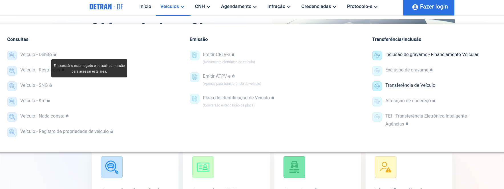
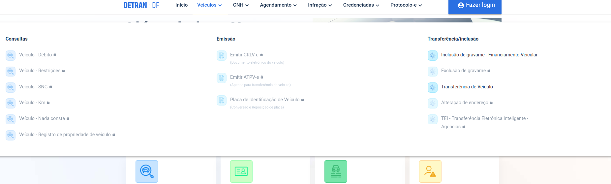

# __Princípios Gerais__

## __Introdução__

Ao projetar um sistema, é fundamental adotar um modelo conceitual que permita ao usuário aprender rapidamente e utilizar o sistema de forma eficaz. O uso de um modelo claro facilita a compreensão das interações, de modo que o usuário possa explorar as funcionalidades do sistema sem dificuldades. Segundo [Barbosa e Silva (2011, p.265)](referencias/principiosGerais/principGerais01.png),  a interpretação do relacionamento entre as ações do sistema, as informações fornecidas e o conhecimento prévio do usuário é essencial para o bom design da interface.

Este artefato visa explorar os princípios e diretrizes gerais de design e como eles se aplicam à realidade do [Portal DETRAN-DF](https://portal.detran.df.gov.br/#/home), com o objetivo de melhorar a interação e a experiência do usuário.

## __Metodologia__

Tendo em vista a literatura usada na disciplina e os princíos e diretrizes gerais, o grupo analisou como esses aspectos podem ser vistos dentro da realidade do [Portal DETRAN-DF](https://portal.detran.df.gov.br/#/home).

A seguir, será descrito cada princípio, destacando sua presença ou ausência no portal, o que contribui para uma análise crítica e construtiva do sistema.

### __Correspondência com as Expectativas dos Usuários__

De acordo com [Barbosa e Silva (2011, p.265)](referencias/principiosGerais/ExpcUser.png), é importante criar conexões intuitivas no design de sistemas, permitindo que os usuários compreendam facilmente a relação entre suas intenções, as ações possíveis e os impectos dessas ações no sistema.

Um exemplo disso é o design de plataformas de e-commerce, que deve permitir a escolha de pordutos sem exigir a identificação do usuário até o momento do pagamento (Figura 1).

__Figura 1: Exemplo de expectativa do usuário__

_Fonte: [Barbosa e Silva (2011, p.265)](referencias/principiosGerais/ExpcUser.png)_

Além disso, as interações devem ser estruturadas de maneira lógica e familiar ao usuário, permitindo que ele execute suas tarefas de forma eficiente e sem erros.

No caso do [Portal DETRAN-DF](https://portal.detran.df.gov.br/#/home), um usuário que deseja buscar informações dentro do site, naturalmente procuraria por uma barra de pesquisa, normalmente posicionada na barra de navegação, para facilitar essa busca. No entanto, essa funcionalidade está ausente no portal, o que impede uma navegação intuitiva e eficaz.

Assim, indica uma frutração por parte do usuário em relação as suas expectativas.

__Figura 2: Página inicial do Portal DETRAN-DF__

_Fonte: [Portal DETRAN-DF](https://portal.detran.df.gov.br/#/home)_

### __Simplicidade nas estruturas das tarefas__

Tarefas estruturadas de forma mais simplificada minimizam as necessidades de planejamento e resolução de problemas por parte dos usuários. 

Para se obter essa simplicidade, segundo [Barbosa e Silva (2011, p.267)](referencias/principiosGerais/SimpEstru.png), algumas abordagens podem ser adotadas como:

- Manter as tarefas inalteradas, oferecendo suporte variado para que os usuários possam aprendê-la e realiza-la com mais facilidade;

- Tornar visíveis elementos invisíveis, utilizando tecnologias para aprimorar o feedback e garantir que o usuário se sinta no controle da tarefa;

- Automatizar total ou parcialmente a tarefa, sem alterar a sua essencia;

- Modificar a natureza da tarefa, se necessário.

No contexto do [Portal DETRAN-DF](https://portal.detran.df.gov.br/#/home), podemos identificar essa simplicidade na estrutura de tarefas na realização de agendamento online de serviços de forma simplificada.

Antes, para realizar um atendimento, o usuário preciava ligar ou ir pessoalmente à uma unidade de atendimento para marcar um horário.

Após essa simplificação, o usuário pode fazer um agendamento de forma rápida inserindo seus dados e selecionando o tipo de serviço e data e hora do atendimento.

__Figura 3: Página de agendamento de serviços__

_Fonte: [Portal DETRAN-DF](https://portal.detran.df.gov.br/#/home)_

### __Equilíbrio entre controle e liberdade do usuário__

É fundamental garantir que os usuários tenham controle sobre o sistema enquanto desfrutam de um nível adequado de liberdade para executar suas tarefas. Essa abordagem busca equilibrar a autonomia do usuário e o suporte necessário para evitar erros ou confusão [(Barbosa e Silva - 2011, p.267)](referencias/principiosGerais/equiliContrLib.png).

É notável que essa diretriz não é respeitada no [Portal DETRAN-DF](https://portal.detran.df.gov.br/#/home) quando o usuário, para ter acesso a diversas informações do Portal, deve estar logado no sistema.

Essa dependência de Login faz com que os usuários precisam criar uma conta ou lembrar de suas credenciasi para acessar informações gerais ou até mesmo saber sobre o que tal página se trata.

De acordo com o que está na imagem a seguir, o usuário pode não saber o que significa "Veículo - SNG" e não sabe o que acesará dentro desta página a não ser que ele esteja logado.

__Figura 4: Falta de controle e liberdade nas ações dentro do Portal__

_Fonte: [Portal DETRAN-DF](https://portal.detran.df.gov.br/#/home)_

### __Consistência e padronização__

Para tornar um sistema mais intuitivo, [(Barbosa e Silva - 2011, p.270)](referencias/principiosGerais/consistPadronizacao.png) destaca a importância de garantir a consistência entre a interface e o modelo conceitual embutido no sistema. Isso significa que toda a experiência do usuário, incluindo interface, documentação e manuais, deve alinhar-se a um modelo lógico e coerente que reflita a operação do sistema.

Quando as expectativas do usuário não são bem estruturadas dentro do sistema, é necessário adotar padrões claros de forma que o usuário tenha alguma forma de se orientar e não se confunda com variações das ações.

Nesse sentido, é visível [Portal DETRAN-DF](https://portal.detran.df.gov.br/#/home) uma padronização dentro das seções da barra de navegação em que todos os tipos de consultas estão agrupadas dentro de sua respectivas subseções, como podemos ver nas imagens a seguir:

__Figura 5: Seção relacionada à Veículos__

_Fonte: [Portal DETRAN-DF](https://portal.detran.df.gov.br/#/home)_

__Figura 6: Seção relacionada à CNH__

_Fonte: [Portal DETRAN-DF](https://portal.detran.df.gov.br/#/home)_

__Figura 7: Seção relacionada à Infrações__

_Fonte: [Portal DETRAN-DF](https://portal.detran.df.gov.br/#/home)_

### __Promoção da eficiência do usuário__ 

Segundo Barbosa e Silva [(2011, p.271)](referencias/principiosGerais/eficienciaUser.png), a eficiência do usuário deve ser priorizada acima da eficiência do sistema. Como as pessoas são mais custosas do que máquinas, economizar tempo e esforço do usuário traz maior retorno. 

Alguns dos principais pontos incluem:

- _Manter o Usuário Ocupado:_ Processos demorados não devem interromper o trabalho do usuário. Sistemas bem projetados permitem que o usuário continue com outras tarefas enquanto ações de fundo são realizadas.

- _Proteger o Trabalho do Usuário:_ Falhas como queda de energia, erros de rede ou falhas humanas não devem resultar na perda do progresso do usuário. Sistemas podem implementar salvamento automático ou backups para garantir segurança.

- _Reconhecer o Contexto do Usuário:_ O sistema deve lembrar o que o usuário fez, onde estava e suas preferências. Isso evita repetição de ações e melhora a experiência.

- _Aceleradores para Usuários Frequentes:_ Fornecer atalhos como teclas de comando (e.g., Ctrl+S para salvar) e automações, como macros ou perfis predefinidos para operações frequentes.

No contexto do [Portal DETRAN-DF](https://portal.detran.df.gov.br/#/home), a ausência de mecanismos para preservar ou reutilizar informações no preenchimento de formulários, como nas figuras 8 e 9, compromete a eficiência e a experiência do usuário, uma vez que pode ocorrer a perda de dados ao recarregar a página ou até mesmo faltar sugestão em sessões futurar que poderiam acelerar o fluxo de preenchimento.

__Figura 8: Preenchimento do Formulário de Inclusão de gravame__

_Fonte: [Portal DETRAN-DF](https://portal.detran.df.gov.br/#/home)_

__Figura 9: Após atualização de página do Formulário de Inclusão de gravame__

_Fonte: [Portal DETRAN-DF](https://portal.detran.df.gov.br/#/home)_

### __Antecipação das necessidades do usuário__

Segundo Barbosa e Silva [(2011, p.272 e p.273)](referencias/principiosGerais/antecipacao.png) o sistema deve ser estruturado de forma que seja possível prever o que o usuário quer, precisa e espera encontrar. 

Nesse sentido, na hora de utilizar o Portal, é interessante que o usuário tenha em mão as ferramentas necessárias para executar cada passo do fuxo do processo desejado, ou seja, tenha acesso à informações úteis que facilitarão sua experiência.

Dentro do portal, pode-se citar que na página de início existe uma seção com os serviços mais acessados, antecipando as ações dos usuários que executarão justamente as ações de seleção desses serviços.

__Figura 10: Página inicial do Portal DETRAN-DF__

_Fonte: [Portal DETRAN-DF](https://portal.detran.df.gov.br/#/home)_

### __Visibilidade e reconhecimento__

### __Conteúdo relevante e expressão adequada e projeto para erros__

## __Referências Bibliográficas__

>_BARBOSA, S. D. J.; SILVA, B. S. Interação Humano-Computador. Rio de Janeiro: Elsevier, 2011._

---

## __Histórico de versão__

| Versão |    Data    |      Descrição      |             Autor(es)                        | Revisores |
|--------|------------|---------------------|----------------------------------------------|-----------|
| `1.0`  | 02/12/2024 | Descrição dos Princípios Gerais do Projeto. | [Luiza Maluf](https://github.com/LuizaMaluf) |  |