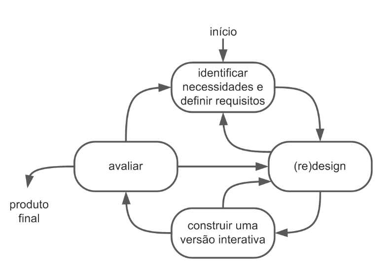
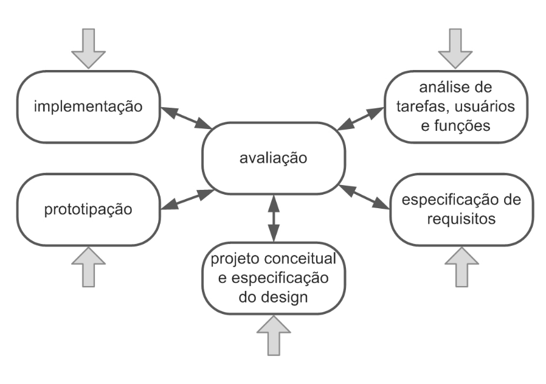

# __Processo de Design__

## __Introdução__

O __processo de design__ é uma metodologia essencial no desenvolvimento de produtos e serviços que
busca criar soluções eficazes e centradas nas necessidades dos usuários.

De acordo com [Barbosa e Silva (2011, p.93)](../assets/referencias/o_que_e_design01.png), o processo de design pode ser entendido como o processo de criação e intervenção em situações do cotidiano, onde se desenvolvem artefatos para resolver problemas ou melhorar as situações existentes.

Esses artefatos, que são produtos criados intencionalmente com um propósito específico, como uma bicicleta ou um copo, não surgem espontaneamente na natureza, mas sim da inteligência e do trabalho humano.

A atividade de design, conforme descrito pelos autores, envolve três etapas principais:

- __Análise da situação atual:__ observar e interpretar o contexto e as necessidades da situação.
- __Síntese de uma intervenção:__ planejar e implementar uma ação ou criação que altere a situação, como a introdução de um novo artefato.
- __Avaliação da nova situação:__ verificar os resultados dessa intervenção, comparando a situação anterior com a nova para entender as mudanças e seu impacto.

O design, portanto, não é apenas a criação de um artefato, mas sim um processo de identificação de problemas e planejamento de intervenções que melhorem a situação para os envolvidos, trazendo consequências positivas e, eventualmente, desafios a serem considerados.

Dentre as diversas técnicas que podem ser utilizadas no processo de design, foram estudados quatro processos, que terão um breve resumo a seguir e a última foi a escolhida pelo grupo para o projeto da disciplina.

## __Modelos de Processos de Designs__

### __Ciclo de Vida Simples__

O Ciclo de Vida Simples é um modelo de desenvolvimento de interfaces que oferece uma estrutura enxuta e direta para o processo de design de sistemas interativos.

[Preece, Sharp e Rogers (2002, 2007)](../assets/referencias/ciclo_vida_simples.png) propuseram um modelo simples para o design de interfaces de interação humano-computador (IHC), que prioriza o design centrado no usuário e a avaliação contínua por meio de protótipos interativos. Esse modelo destaca a importância de iterar continuamente entre as atividades, permitindo um refinamento gradual da solução com base no feedback dos usuários.

Em termos de estrutura, o modelo segue uma sequência de atividades gerais de design e divide a etapa de síntese em duas atividades específicas: o design (ou redesenho) conceitual e a construção de uma versão interativa. 

Durante o design conceitual, o designer explora várias alternativas para formular uma solução que atenda aos requisitos e necessidades identificados anteriormente na análise. As soluções propostas podem ser documentadas em diferentes formatos, como cenários que descrevem a interação, esboços de interface ou outros modelos que representem a interface e a interação do usuário com o sistema.

A construção de versões interativas é essencial para testar e validar essas propostas de solução, pois os protótipos simulam a interface final, proporcionando uma experiência tangível para os usuários. Isso facilita a avaliação da IHC, permitindo que os usuários experimentem a interação projetada e forneçam feedback direto.

_Fonte:  Barbosa e Silva (2011)._

### __Ciclo de Vida em Estrela__

O Ciclo de Vida em Estrela, segundo [Barbosa e Silva (2011, p.103)](../assets/referencias/ciclo_estrela.png), desenvolvido por Hix e Hartson (1993), foi um dos primeiros modelos de design voltados para Interação Humano-Computador (IHC) e é composto por seis atividades principais. 

Ele começa com a análise de tarefas, usuários e funções, que visa compreender a situação atual e identificar necessidades e oportunidades de melhoria. Em seguida, a especificação de requisitos de IHC define os problemas que devem ser resolvidos com o projeto.

O processo de síntese é dividido em três atividades: __projeto conceitual e especificação do design__, onde se concebe a solução de IHC; __prototipação__, na qual são criadas versões interativas para avaliação; e __implementação__, onde o sistema interativo final é desenvolvido. A __avaliação__ é a atividade central do modelo, e ocorre após cada uma das demais atividades, garantindo que os resultados atendam às necessidades dos usuários e detectando problemas de usabilidade desde o início.

No Ciclo de Vida em Estrela, a sequência das atividades não é fixa, e o designer pode escolher o ponto de partida com base nos recursos e informações disponíveis. O modelo é iterativo e exige que cada etapa seja avaliada antes de prosseguir, permitindo um processo flexível e contínuo de melhorias.

_Fonte:  Barbosa e Silva (2011)._

### __Engenharia de Usabilidade de Nielsen__

Segundo [Barbosa e Silva (2011, p.104 a 106)](../assets/referencias/eng_usab_nielsen.png) é um conjunto de atividades projetadas para serem realizadas ao longo de todo o ciclo de vida do produto, com foco nas etapas iniciais do projeto, antes mesmo de a interface ser criada. 

Essas atividades incluem conhecer o usuário, realizar análise competitiva, definir metas de usabilidade, adotar designs paralelos e participativos, coordenar o design da interface, aplicar diretrizes heurísticas, prototipar, testar empiricamente e adotar um design iterativo.

### __Engenharia de Usabilidade de Mayhew__

Segundo [Barbosa e Silva (2011, p.109 a 111)](../assets/referencias/eng_usab_mayhew.png), a engenharia de usabilidade organiza o processo de design em três fases principais: análise de requisitos, design/avaliação/desenvolvimento e instalação. Este modelo, com abordagem holística, busca integrar diferentes atividades de IHC para direcionar o designer a uma solução interativa eficaz.

Na fase de __análise de requisitos__, são estabelecidas as metas de usabilidade com base no perfil dos usuários, tarefas, características da plataforma e princípios de design de IHC. Essas metas frequentemente são documentadas em "guias de estilos" para garantir sua aplicabilidade nas etapas seguintes.

A fase de __design, avaliação e desenvolvimento__ busca criar uma solução de IHC que atenda às metas definidas. Este processo é dividido em três níveis de detalhe: no primeiro nível, realiza-se a reengenharia das tarefas e o desenvolvimento de protótipos de baixa fidelidade; no segundo, são criados padrões de design e protótipos de média fidelidade; no terceiro, ocorre o projeto detalhado da interface, que passa por avaliação com usuários.

Por fim, na fase de __instalação__, o designer coleta feedback dos usuários após um período de uso, o que pode servir para aprimoramentos futuros e para guiar o desenvolvimento de novos sistemas interativos.

_Fonte:  Barbosa e Silva (2011)._

## __Nossa Escolha__

Escolhemos a __Engenharia de Usabilidade de Mayhew__ como base para nosso processo de design devido à sua abordagem estruturada e prática, que se alinha diretamente com as necessidades do nosso projeto de Interação Humano-Computador. 

Esse modelo oferece uma metodologia orientada por fases, com etapas claramente definidas que facilitam a implementação de usabilidade desde o início do desenvolvimento até a fase de testes. 

A Engenharia de Usabilidade de Mayhew permite que façamos uma análise detalhada das necessidades dos usuários, garantindo que o produto final seja intuitivo, eficiente e atenda às expectativas. Além disso, o modelo fornece diretrizes para avaliação e iteração contínuas, o que é fundamental para aprimorar constantemente o design com base no feedback dos usuários. 

Dessa forma, ao adotar a Engenharia de Usabilidade de Mayhew, asseguramos que nosso projeto siga um caminho bem estruturado para alcançar uma experiência de usuário de alta qualidade e acessível.

## __Referências Bibliográficas__

_BARBOSA, S. D. J.; SILVA, B. S. Interação Humano-Computador. Rio de Janeiro: Elsevier, 2011._

---
## __Histórico de versão__

| Versão |    Data    |      Descrição      |             Autor(es)                        |
|--------|------------|---------------------|----------------------------------------------|
| `1.0`  | 04/11/2024 | Criação do página   | [Luiza Maluf](https://github.com/LuizaMaluf) |
| `2.0`  | 06/11/2024 | Descrição dos processos de design | [Luiza Maluf](https://github.com/LuizaMaluf) |
| `3.0`  | 11/11/2024 | Correção do artefato com base na [verificação](../verificacao/grupo/etapa1/verificacao-processo-design.md) feita. | [Luiza Maluf](https://github.com/LuizaMaluf) 