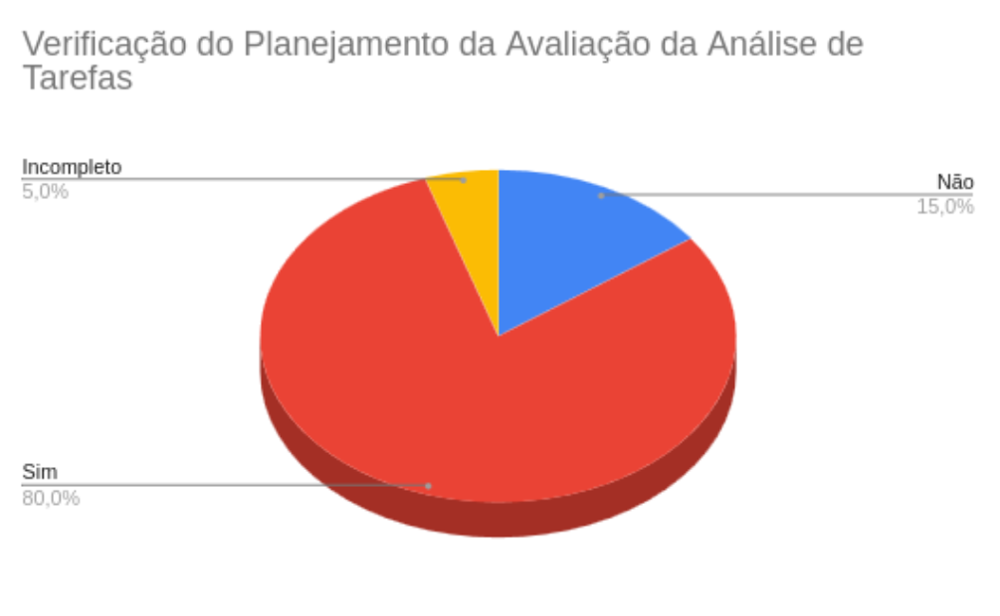

# __Verificação do Planejamento da Avaliação da Análise de Tarefas__

## __Introdução__

Este documento detalha a verificação do artefato [Planejamento da Avaliação da Análise de Tarefas](/docs/design_avaliacao/analise_tarefa/planej_avalia.md).

## __Metodologia__

O modelo de verificação consistirá em um preenchimento de uma lista de verificação construída a partir dos conceitos trabalhados pela disciplina.

**Tabela 1** - Lista de Verificação

|  ID   | Descrição | Avaliação  |                Observações                | Autor da Pergunta |
| :--:  | ----------| :--------: | :---------------------------------------: | :---------------: |
|       | **Lista de Verificação para os Itens Gerais**|   
| **1** | O artefato possui introdução?|   **SIM**    | - |
| **2** | O artefato possui uma bibliografia/referência bibliográfica?| **SIM** | -  |
| **3** | O artefato possui um histórico de versões com o id e descrição das versões, data, autores e revisores? | **SIM** |-| 
| **4** | Todas as tabelas e imagens são chamadas no texto, possuem legendas e fontes?|**SIM** | - |
| **5** | Todos os textos estão na norma padrão? |**SIM** |   -   |
|       | **Planejamento da Avaliação da Análise de Tarefas** |
| **6**  | O planejamento detalha claramente os objetivos da análise de tarefas?  | **NÃO**| Há somente os objetivos da avaliação.  | [Luiza Maluf](https://github.com/LuizaMaluf) |
| **7**  | O planejamento segue o framework DECIDE (Definir, Explorar, Contextualizar, Identificar, Decidir e Avaliar)?|**SIM**|  -  | [Luiza Maluf](https://github.com/LuizaMaluf) |
| **8**  | Os objetivos da avaliação estão definidos de forma clara no documento?|**SIM**|  -  |  [Luiza Maluf](https://github.com/LuizaMaluf) |
| **9**  | As perguntas-chave que devem ser respondidas durante a avaliação estão listadas?|**SIM**|  -  |  [Luiza Maluf](https://github.com/LuizaMaluf) |
| **10** | As perguntas selecionadas possuem referências que justificam sua inclusão?|**NÃO**| Não existe. | [Luiza Maluf](https://github.com/LuizaMaluf) |
| **11** | Os métodos de avaliação a serem utilizados estão especificados?|**SIM**|  -  | [Luiza Maluf](https://github.com/LuizaMaluf) |
| **12** | O documento especifica quem serão os participantes da avaliação?|**SIM**|  -  | [Luiza Maluf](https://github.com/LuizaMaluf) |
| **13** | A justificativa para a quantidade de participantes selecionados está descrita?|**Não**|  -  | [Luiza Maluf](https://github.com/LuizaMaluf) |
| **14** | Os perfis dos participantes estão alinhados com os perfis de usuário definidos na análise?| **Incompleto** | Não há nada que diz respeito aos perfis dos participantes e como eles se enquadram. | [Luiza Maluf](https://github.com/LuizaMaluf) |
| **15** | O papel de cada participante durante a avaliação está claramente definido?|**SIM**|  -  | [Luiza Maluf](https://github.com/LuizaMaluf) |
| **16** | Existe um cronograma detalhado com datas, horários e locais para a execução da avaliação?|**SIM**|  -  | [Luiza Maluf](https://github.com/LuizaMaluf) |
| **17** | As ferramentas e os equipamentos necessários para a avaliação estão listados?|**SIM**|  -  | [Luiza Maluf](https://github.com/LuizaMaluf) |
| **18** | Os custos associados à avaliação estão descritos?|**SIM**|  -  | [Luiza Maluf](https://github.com/LuizaMaluf) |
| **19** | Os recursos de mão de obra necessários para realizar a avaliação estão especificados?|**SIM**|  -  | [Luiza Maluf](https://github.com/LuizaMaluf) |
| **20** | O planejamento aborda como serão tratados os aspectos éticos durante a avaliação?|**SIM**|  -  | [Luiza Maluf](https://github.com/LuizaMaluf) |
| **21** | O documento descreve como os dados serão interpretados e apresentados após a avaliação?|**SIM**|  -  | [Luiza Maluf](https://github.com/LuizaMaluf) |
| **22** | As tarefas para a execução da avaliação estão detalhadas de forma clara e sequencial?|**SIM**|  -  | [Luiza Maluf](https://github.com/LuizaMaluf) |
| **23** | Existe uma seção dedicada ao teste piloto, com definição, participantes, local, data e horário?|**NÃO**|  -  | [Luiza Maluf](https://github.com/LuizaMaluf) |
| **24** | O planejamento prevê a gravação ou registro do teste piloto para revisão posterior?|**NÃO**|  -  | [Luiza Maluf](https://github.com/LuizaMaluf) |
| **25** | O documento detalha como os dados coletados serão documentados e tratados, incluindo confiabilidade das respostas e conformidade com o perfil de usuário?|**Incompleto**| Falta deixar mais completa as informações. | [Luiza Maluf](https://github.com/LuizaMaluf) |

_AUTOR: [Luiza Maluf](https://github.com/LuizaMaluf)_

## __Resultados e Melhorias__

- Deixar explícito se os participantes da avaliação estão em conformidade com os perfis do  usuário definido.
- Justificar a necessidade da quantidade de participantes da avaliação.
- Inserir uma seção para inserir melhorias ou plano de repojeto do sistema.
- Inserir uma seção para o teste piloto.

## Referências Bibliográficas

> Barbosa, S. D. J.; Silva, B. S. da; Silveira, M. S.; Gasparini, I.; Darin, T.; Barbosa, G. D. J. (2021);Interação Humano-Computador e Experiência do usuário.

---

## Histórico de Versões

| Versão | Data       | Descrição                                     | Autor(es)                                        | Revisor(es)                                    |
| ------ | ---------- | --------------------------------------------- | ------------------------------------------------ | ---------------------------------------------- |
| `1.0`  | 09/12/2024 | Criação do documento.   | [Luiza Maluf](https://github.com/LuizaMaluf) | [Márcio Henrique](https://github.com/DeM4rcio)|