# __Planejamento da Verificação Final__

## __Introdução__

A verificação é uma das etapas mais importantes do desenvolvimento de um projeto. Nela os artefatos produzidos são analisados garantindo que os mesmos cumpram com os seus requisitos especificados. 

## __Objetivos__

O objetivo deste documento é verificar se os artefatos produzidos durante toda a execução do Trabalho da disciplina de IHC do Grupo 8 estão de acordo com o que foi estudado durante o semestre.

## __Metodologia__

A metodologia escolhida para esta verificação é a inspeção. Desenvolvida originalmente para códigos de software por Fagan na IBM em 1976, essa técnica consiste em uma revisão formal dos artefatos produzidos a fim de se encontrar defeitos. 

Essa revisão é realizada através de uma checklist onde se tem uma lista com os defeitos mais comuns que deverão ser identificados, analisados e classificados. Vale ressaltar que a leitura do artefato não deve ser feita pelo o autor do mesmo. Ao findar a verificação, será exibido um gráfico referente aos resultados obtidos.

## __Participantes__

O responsável pelas verificações são os integrantes do Grupo 8: [Márcio Henrique](https://github.com/DeM4rcio) e [Luiza Maluf](https://github.com/LuizaMaluf), os quais realizam tanto a verificação do planejamento e do relato de seus resultados.

## __Cronograma__

**Tabela 1** - Cronograma

| Data | Descrição | Responsável |
|------|-----------|-------------|
|03/02/2025 | Verificação final| [Márcio Henrique](https://github.com/DeM4rcio) e [Luiza Maluf](https://github.com/LuizaMaluf) |

_Autor: [Márcio Henrique](https://github.com/DeM4rcio) , 2025._

## __Lista de Verificação__

### __Personas__

| ID | Pergunta | Referência | Responsável | Resposta |
|----|----------|------------|-------------|----------|
|**1**| Foi dada a cada persona uma identidade, como nome e sobrenome, idade, dados demográficos e foto? | 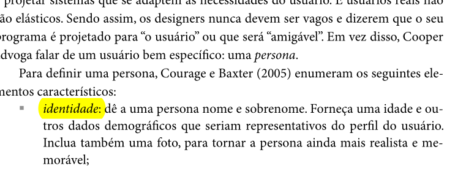 
 _Fonte: Página 177, Capítulo 6. Organização do Espaço do Problema. Livro: SIMONE DINIZ JUNQUEIRO BARBOSA, BRUNO SANTANA DA SILVA, Interação Humano-Computador, 1a. Edição, Editora Campus, 2010. Publicado em: 03/05/2021._
| [Luiza Maluf](https://github.com/LuizaMaluf) | Conforme|
|**2**| Cada persona teve sua classificação foi definida e “Primária”, “Secundária”,  “Anti-persona” ou “outro stakeholder” ? | 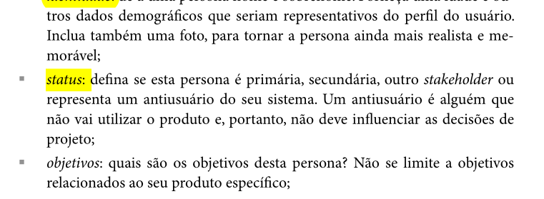 
 _Fonte: Página 177, Capítulo 6. Organização do Espaço do Problema. Livro: SIMONE DINIZ JUNQUEIRO BARBOSA, BRUNO SANTANA DA SILVA, Interação Humano-Computador, 1a. Edição, Editora Campus, 2010. Publicado em: 03/05/2021._
 | [Luiza Maluf](https://github.com/LuizaMaluf) | Conforme |
|**3**| As personas desenvolvidas, possuem seus objetivos definidos? ( objetivo pessoal, objetivo prático e objetivo) | 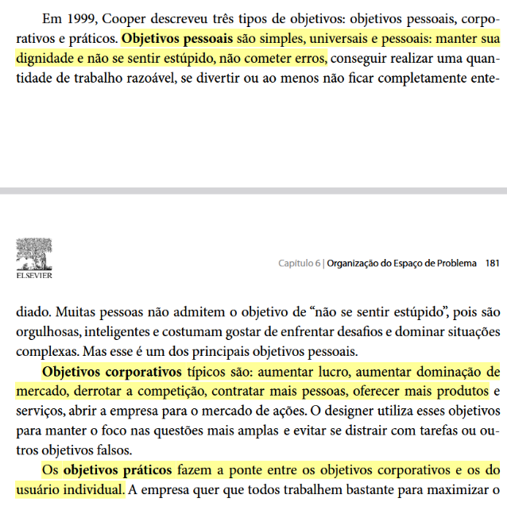 
 _BARBOSA, Simone; SILVA, Bruno. Interação Humano-Computador. Rio de Janeiro: LTC, 2010. p. 181_ 
 |[Márcio Henrique](https://github.com/DeM4rcio) | Conforme|
|**4**| Foi descrito quais tarefas básicas dizem respeito a cada persona, incluindo informações como “com qual frequência, duração e importância essas tarefas são realizadas?| 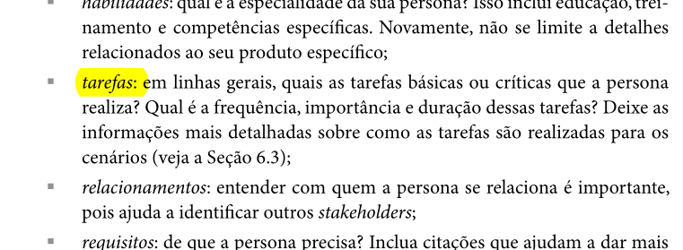 
 _Fonte: Página 177, Capítulo 6. Organização do Espaço do Problema. Livro: SIMONE DINIZ JUNQUEIRO BARBOSA, BRUNO SANTANA DA SILVA, Interação Humano-Computador, 1a. Edição, Editora Campus, 2010. Publicado em: 03/05/2021._ 
 | [Luiza Maluf](https://github.com/LuizaMaluf) | Conforme|
|**5**| A persona primária segue os princípios definidos para uma persona primária, como ser alguém que as necessidades devem ser satisfeitas e, principalmente, por uma interface projetada sob sua ótica? | 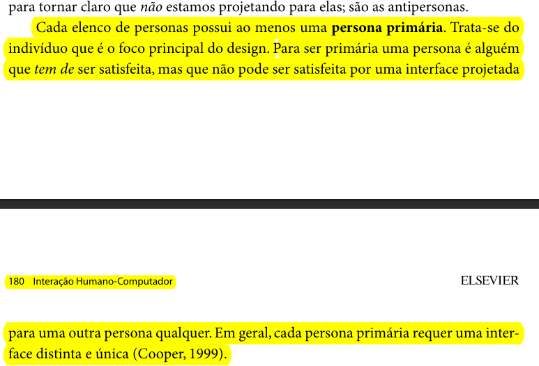 
 _Fonte: Página 179, Capítulo 6. Organização do Espaço do Problema. Livro: SIMONE DINIZ JUNQUEIRO BARBOSA, BRUNO SANTANA DA SILVA, Interação Humano-Computador, 1a. Edição, Editora Campus, 2010. Publicado em: 03/05/2021._ 
 | [Luiza Maluf](https://github.com/LuizaMaluf) | Conforme |
|**6**| A persona primária possui elasticidade? (Uma persona assume uma solidez tangível que coloca os pressupostos de design em perspectiva. À medida que uma persona perde sua elasticidade, podemos identificar suas habilidades, suas motivações e o que ela quer alcançar.)| 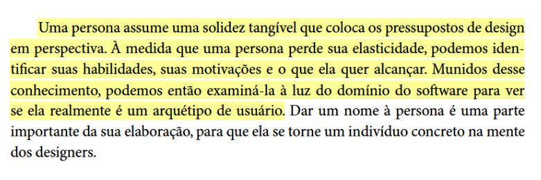 
 _Fonte: BARBOSA, Simone; SILVA, Bruno. Interação Humano-Computador. Rio de Janeiro: LTC, 2010. p. 179_ 
|[Márcio Henrique](https://github.com/DeM4rcio) | Não se aplica completamente|

### __Elenco de Pessoas__

| ID | Pergunta | Referência | Responsável | Resposta |
|----|----------|------------|-------------|----------|
|**1**| O elenco foi suficiente para cobrir os principais grupos de usuários, de forma que seja possível ajudar a desenvolver um produto que funciona para todos? |  
 _Fonte: Página 180, Capítulo 6. Organização do Espaço do Problema. Livro: SIMONE DINIZ JUNQUEIRO BARBOSA, BRUNO SANTANA DA SILVA, Interação Humano-Computador, 1a. Edição, Editora Campus, 2010. Publicado em: 03/05/2021._
| [Luiza Maluf](https://github.com/LuizaMaluf) | Conforme|
|**2**| No elenco, é utilizado tem entre 3-12 personas tais que atendem a ter no mínimo uma persona primária ?| 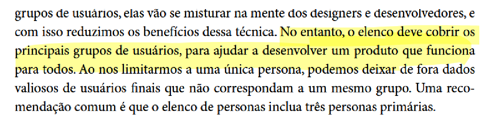 
 _Fonte: BARBOSA, Simone; SILVA, Bruno.Interação Humano-Computador. Rio de Janeiro: LTC, 2010. p.179_ 
 | [Márcio Henrique](https://github.com/DeM4rcio) |Conforme |
|**3**| O elenco de personas possui pelo menos uma persona primária? | 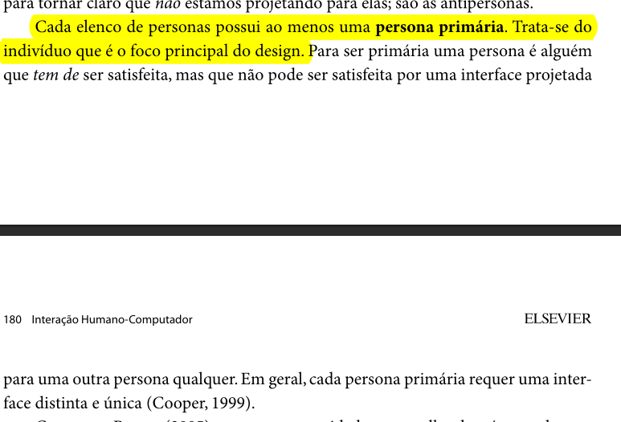 
 _BARBOSA, Simone; SILVA, Bruno. Interação Humano-Computador. Rio de Janeiro: LTC, 2010. p. 181_ 
 | [Luiza Maluf](https://github.com/LuizaMaluf) |Conforme |
|**4**| O elenco cobre os principais grupos de usuários, para ajudar a desenvolver um produto que funciona para todos?| 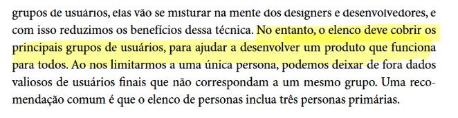 
 _Fonte: BARBOSA, Simone; SILVA, Bruno.Interação Humano-Computador. Rio de Janeiro: LTC, 2010. p. 180_ 
 | [Márcio Henrique](https://github.com/DeM4rcio) | Conforme |

### __Cenários__

| ID | Pergunta | Referência | Responsável | Resposta |
|----|----------|------------|-------------|----------|
|**1**| Os cenários descrevem o comportamento e as expectativas dos atores/personas? | 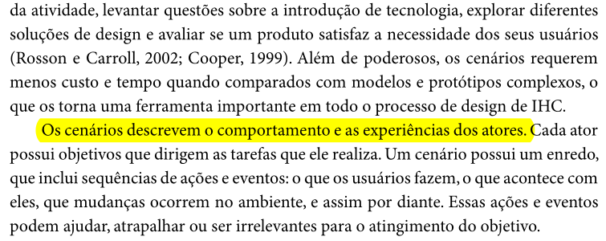 
 _Fonte: Página 183, Capítulo 6. Organização do Espaço do Problema. Livro: SIMONE DINIZ JUNQUEIRO BARBOSA, BRUNO SANTANA DA SILVA, Interação Humano-Computador, 1a. Edição, Editora Campus, 2010. Publicado em: 03/05/2021._
| [Luiza Maluf](https://github.com/LuizaMaluf) | Conforme|
|**2**| Os cenários possuem um enredo incluindo as sequências de ações e eventos que os usuários devem seguir, incluindo o que acontece com cada um deles, as mudanças de ambiente que eles sofrem e etc? | 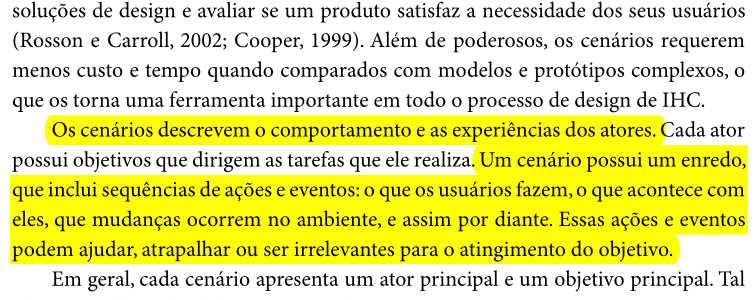 
 _Fonte: Página 183, Capítulo 6. Organização do Espaço do Problema. Livro: SIMONE DINIZ JUNQUEIRO BARBOSA, BRUNO SANTANA DA SILVA, Interação Humano-Computador, 1a. Edição, Editora Campus, 2010. Publicado em: 03/05/2021._ 
 | [Luiza Maluf](https://github.com/LuizaMaluf)|Não se aplica completamente  |
|**3**|  Para cada cenário foi apresentado um ator principal e um objetivo principal, sendo que cada objetivo foi desdobrado em subobjetivos que dizem respeito as atividades de planejamento dos atores?| 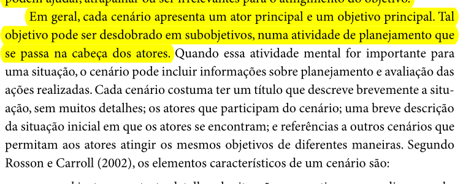 
 _Página 183, Capítulo 6. Organização do Espaço do Problema. Livro: SIMONE DINIZ JUNQUEIRO BARBOSA, BRUNO SANTANA DA SILVA, Interação Humano-Computador, 1a. Edição, Editora Campus, 2010. Publicado em: 03/05/2021._ 
 | [Luiza Maluf](https://github.com/LuizaMaluf) | Não se aplica completamente |
|**4**| Cada cenário possui os elemento característicos de um cenário, como, ambiente ou contexto, atores, objetivos, planejamento, ações, eventos, avaliação e etc?| 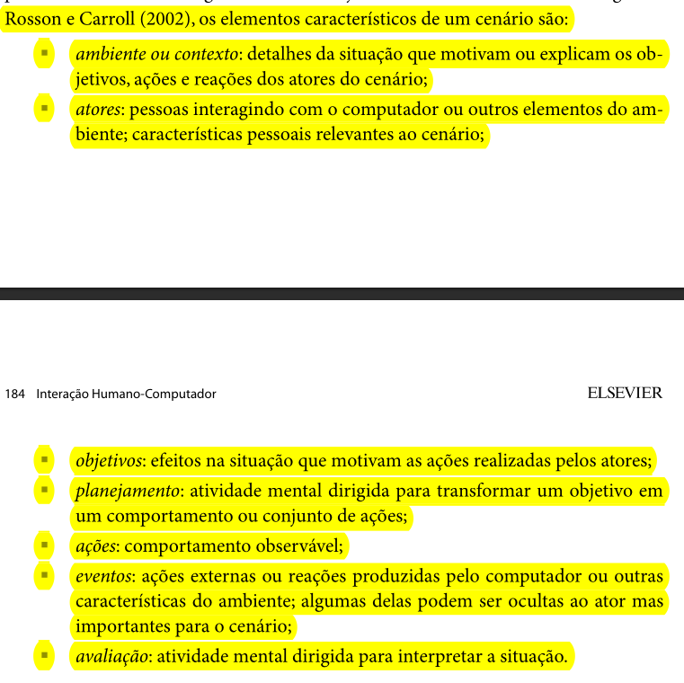 
 _Fonte: Páginas 183 e 184, Capítulo 6. Organização do Espaço do Problema. Livro: SIMONE DINIZ JUNQUEIRO BARBOSA, BRUNO SANTANA DA SILVA, Interação Humano-Computador, 1a. Edição, Editora Campus, 2010. Publicado em: 03/05/2021._ 
 | [Luiza Maluf](https://github.com/LuizaMaluf) | Conforme |
|**5**| Os cenários tem atores que condizem com as personas do projeto? | 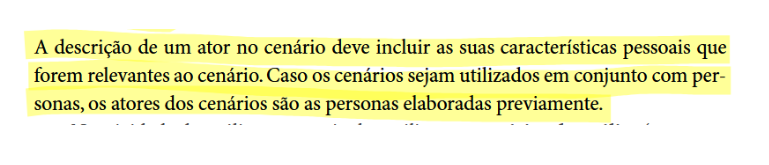 
 _Fonte: BARBOSA, Simone; SILVA, Bruno. Interação Humano-Computador. Rio de Janeiro: LTC, 2010. p. 184_ 
 | [Márcio Henrique](https://github.com/DeM4rcio) | Conforme |

### __Análise Hierárquica de Tarefas__

| ID | Pergunta | Referência | Responsável | Resposta |
|----|----------|------------|-------------|----------|
|**1**| Os objetivos tratados no HTA a serem alcançados são apresentados? | 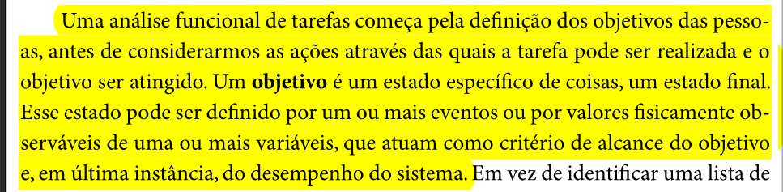 
 _Fonte: Página 192, Capítulo 6. Organização do Espaço do Problema. Livro: SIMONE DINIZ JUNQUEIRO BARBOSA, BRUNO SANTANA DA SILVA, Interação Humano-Computador, 1a. Edição, Editora Campus, 2010. Publicado em: 03/05/2021._
| [Márcio Henrique](https://github.com/DeM4rcio) | Conforme |
|**2**| As operações são especificadas no objetivo é ativado por meio de input ou entrada, pelas atividades ou ações (actions) que contribuem para atingi-lo? | 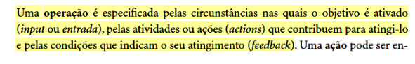 
 _Fonte: BARBOSA, Simone; SILVA, Bruno. Interação Humano-Computador. Rio de Janeiro: LTC, 2010. p. 193_ 
 | [Márcio Henrique](https://github.com/DeM4rcio)| Conforme|
|**3**| A HTA está estruturada em objetivos de alto nível e subobjetivos?| 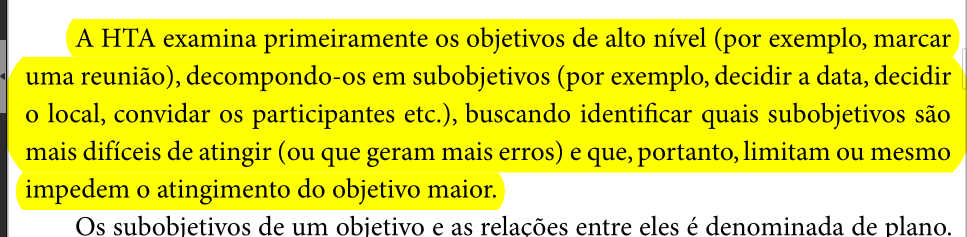 
 _Fonte: Página 193, Capítulo 6. Organização do Espaço do Problema. Livro: SIMONE DINIZ JUNQUEIRO BARBOSA, BRUNO SANTANA DA SILVA, Interação Humano-Computador, 1a. Edição, Editora Campus, 2010. Publicado em: 03/05/2021._ 
 | [Luiza Maluf](https://github.com/LuizaMaluf) | Conforme |
|**4**|A decomposição termina quando os objetivos são atingidos ou quando a origem de um erro é identificada?| 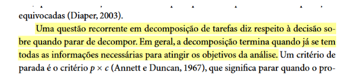 
 _Fonte: BARBOSA, Simone; SILVA, Bruno. Interação Humano-Computador. Rio de Janeiro: LTC, 2010. p. 195_ 
 | [Márcio Henrique](https://github.com/DeM4rcio) | Conforme|
|**5**| As operações descrevem as diversas ações que devem ser desempenhadas para atingir o objetivo de cada tarefa?| 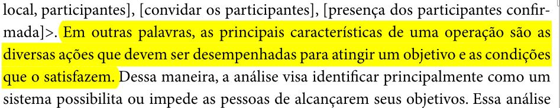 
 _Fonte: Página 193, Capítulo 6. Organização do Espaço do Problema. Livro: SIMONE DINIZ JUNQUEIRO BARBOSA, BRUNO SANTANA DA SILVA, Interação Humano-Computador, 1a. Edição, Editora Campus, 2010. Publicado em: 03/05/2021._ 
 | [Márcio Henrique](https://github.com/DeM4rcio) | Conforme|

### __Planejamento da Avaliação com Framework DECIDE__

| ID | Pergunta | Referência | Responsável | Resposta |
|----|----------|------------|-------------|----------|
|**1**| Os objetivos gerais da avaliação foram definidos claramente? |  
 _Fonte: Página 313, Capítulo 9. Planejamento da avaliação de IHC. Livro: SIMONE DINIZ JUNQUEIRO BARBOSA, BRUNO SANTANA DA SILVA, Interação Humano-Computador, 1a. Edição, Editora Campus, 2010. Publicado em: 03/05/2021._
| [Luiza Maluf](https://github.com/LuizaMaluf) |Conforme |
|**2**| A importância dos objetivos foi justificada? | 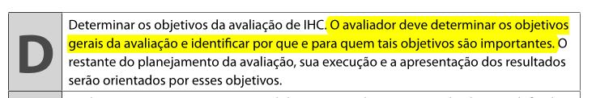 
 _Fonte: Página 313, Capítulo 9. Planejamento da avaliação de IHC. Livro: SIMONE DINIZ JUNQUEIRO BARBOSA, BRUNO SANTANA DA SILVA, Interação Humano-Computador, 1a. Edição, Editora Campus, 2010. Publicado em: 03/05/2021._
| [Luiza Maluf](https://github.com/LuizaMaluf) | Conforme|
|**3**| O planejamento possui quais são as perguntas a serem respondidas com a avaliação? e devidamente referenciado | 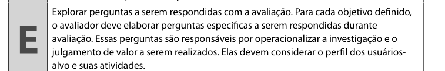 
 _Fonte: Página 313, Capítulo 9. Planejamento da avaliação de IHC. Livro: SIMONE DINIZ JUNQUEIRO BARBOSA, BRUNO SANTANA DA SILVA, Interação Humano-Computador, 1a. Edição, Editora Campus, 2010. Publicado em: 03/05/2021._
| [Márcio Henrique](https://github.com/DeM4rcio) |Conforme |
|**4**| O planejamento possui quais são os métodos a serem utilizados na avaliação? | 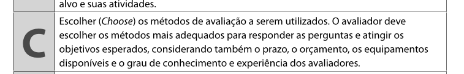 
 _Fonte: Página 313, Capítulo 9. Planejamento da avaliação de IHC. Livro: SIMONE DINIZ JUNQUEIRO BARBOSA, BRUNO SANTANA DA SILVA, Interação Humano-Computador, 1a. Edição, Editora Campus, 2010. Publicado em: 03/05/2021._
| [Márcio Henrique](https://github.com/DeM4rcio) | Conforme|
|**5**| As questões éticas foram identificadas e consideradas na avaliação? | 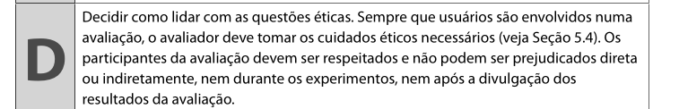 
 _Fonte: Página 313, Capítulo 9. Planejamento da avaliação de IHC. Livro: SIMONE DINIZ JUNQUEIRO BARBOSA, BRUNO SANTANA DA SILVA, Interação Humano-Computador, 1a. Edição, Editora Campus, 2010. Publicado em: 03/05/2021._
| [Luiza Maluf](https://github.com/LuizaMaluf)| Conforme|
|**6**| O planejamento apresenta como serão documentados e ratados os dados obtidos durante o processo de avaliação? (Grau de confiabilidade das respostas, contexto em que as respostas foram produzidas e se os dados obtidos estão em conformidade com o perfil de usuário traçado.) | 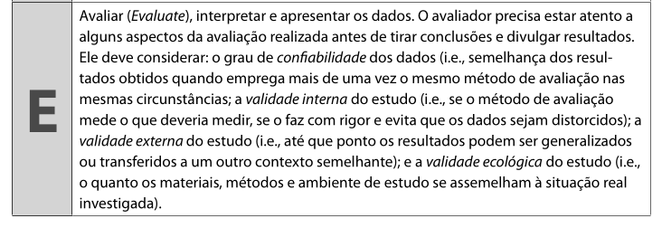 
 _Fonte: Página 313, Capítulo 9. Planejamento da avaliação de IHC. Livro: SIMONE DINIZ JUNQUEIRO BARBOSA, BRUNO SANTANA DA SILVA, Interação Humano-Computador, 1a. Edição, Editora Campus, 2010. Publicado em: 03/05/2021._
| [Márcio Henrique](https://github.com/DeM4rcio)|  Não se aplica completamente|
|**7**|  As conclusões foram comparadas com os objetivos iniciais da avaliação? |  
 _Fonte: Página 313, Capítulo 9. Planejamento da avaliação de IHC. Livro: SIMONE DINIZ JUNQUEIRO BARBOSA, BRUNO SANTANA DA SILVA, Interação Humano-Computador, 1a. Edição, Editora Campus, 2010. Publicado em: 03/05/2021._
| [Luiza Maluf](https://github.com/LuizaMaluf)| Conforme|
|**7**| O planejamento possui teste piloto? | 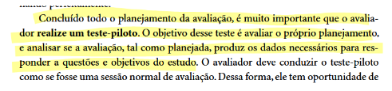 
 _Fonte: Página 313, Capítulo 9. Planejamento da avaliação de IHC. Livro: SIMONE DINIZ JUNQUEIRO BARBOSA, BRUNO SANTANA DA SILVA, Interação Humano-Computador, 1a. Edição, Editora Campus, 2010. Publicado em: 03/05/2021._
| [Márcio Henrique](https://github.com/DeM4rcio)| Não se aplica completamente |

## __Referências Bibliográficas__

> Barbosa, S. D. J.; Silva, B. S. da; Silveira, M. S.; Gasparini, I.; Darin, T.; Barbosa, G. D. J. (2021);Interação Humano-Computador e Experiência do usuário.

## __Histórico de Versões__

| Versão | Data       | Descrição              | Autor(es)                                        | Revisor(es)                                    |
| ------ | ---------- | ---------------------- | ------------------------------------------------ | ---------------------------------------------- |
| `1.0`| 03/02/2025 | Criação do documento e adição das listas. | [LuizaMaluf](https://github.com/LuizaMaluf) | [Márcio Henrique](https://github.com/DeM4rcio) |
